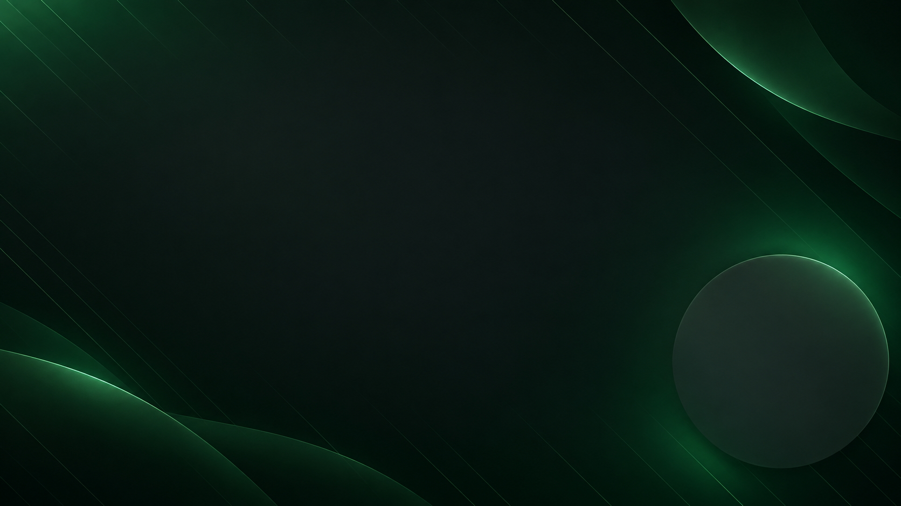
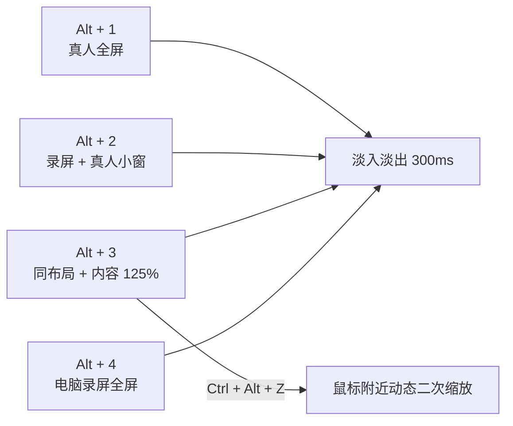

<div align="center">

# OBS Talk Demo Studio

### 一套为中文个人 IP、产品演示与知识分享设计的 OBS 录制工作台

[](https://obsproject.com/)
[](#快速开始)
[](#它解决什么问题)
[](LICENSE)



**少记快捷键，少切重复场景，把注意力留给表达。**

</div>

## 这是什么仓库？

这是一个可复用、可版本管理的 **OBS 录屏配置仓库**。它把场景集合、1440p30 录制参数、音频轨道、极简快捷键、Camo/iPhone 圆形真人小窗、轻柔循环背景，以及 Zoominator 的柔和水波点击效果整理到一起。

它不是 OBS 的完整发行版，也不会包含任何人的摄像头 ID、显示器 ID、WebSocket 密码或录屏内容。

## 它解决什么问题

- **快捷键记不住**：四个主场景固定对应 `Alt + 1/2/3/4`，按画面层级顺序记忆。
- **重点演示与普通录屏难区分**：重点缩放继承“录屏 + 真人小窗”的完整布局，只把软件内容放大约 125%。
- **真人小窗像临时贴图**：使用 Camo 风格圆形构图、翡翠圆环和轻柔光晕形成稳定层级。
- **小窗里的人太小**：用独立嵌套场景二次放大人物，只裁切小窗，不改变真人全屏。
- **全屏捕获暴露无关内容**：默认增加可手选的窗口捕获来源，可锁定浏览器、PPT 或任意软件。
- **静态背景太死**：12 秒无声无缝循环，运动幅度控制在亚百分比级。
- **点击提示生硬**：把静态圆圈改为三层同心波纹，并做 920ms 的缓出扩散与渐隐。
- **配置难以迁移**：机器相关字段全部留空，由安装脚本生成本机配置。

## 四个主场景

| 快捷键 | 动作 | 使用时机 |
|---|---|---|
| `Alt + 1` | 真人全屏 | 开场、总结、强调观点 |
| `Alt + 2` | 电脑录屏 + 真人小窗 | 主力讲解场景 |
| `Alt + 3` | 重点缩放 | 保留真人小窗，把软件内容放大约 125% |
| `Alt + 4` | 电脑录屏全屏 | 需要最大可读面积时 |
| `Ctrl + Alt + Z` | 鼠标附近平滑放大 / 恢复 | 继续聚焦按钮、表格或关键区域 |
| `Ctrl + Alt + F` | 开 / 关鼠标跟随 | 决定放大后是否跟随鼠标移动 |
| `Alt + R` | 开始 / 停止录制 | 录制控制 |

记忆时只分两组：`Alt + 1/2/3/4` 管画面，`Ctrl + Alt + Z/F` 管缩放；其中 `Z` 是 Zoom，`F` 是 Follow。暂停录制仍从 OBS 面板操作，避免误触。

## 场景设计



声音通过隐藏的 `00 音频总线` 统一进入四个展示场景：轨道 1 为混音，轨道 2 为麦克风，轨道 3 为系统声音，方便后期独立处理。

## 快速开始

要求：Windows 11、OBS Studio 32+、PowerShell 7（Windows PowerShell 5.1 也可运行安装脚本）。

```powershell
git clone https://github.com/jedliuai/OBS-talk-demo-studio.git
cd OBS-talk-demo-studio
powershell -ExecutionPolicy Bypass -File .\scripts\install.ps1
```

安装前请退出 OBS。脚本会自动备份同名配置，然后安装：

1. 场景集合 `个人IP录制工作台`
2. 配置文件 `个人IP录制_1440p30`
3. Zoominator 极简快捷键配置
4. 翡翠品牌背景素材

重开 OBS 后，只需在来源属性里选择自己的软件窗口、Camo/iPhone 摄像头和麦克风。完整步骤见 [安装说明](docs/INSTALL.md) 与 [窗口捕获说明](docs/WINDOW_CAPTURE.md)。

可选：以管理员身份安装可复现构建的水波版 Zoominator：

```powershell
powershell -ExecutionPolicy Bypass -File .\scripts\install-ripple-plugin.ps1
```

## 柔和水波点击效果

`plugin/zoominator-ripple.patch` 基于 [Zoominator 2.0.6](https://github.com/mmlTools/zoominator/tree/2.0.6) 制作：

- 单圈改为三层半透明同心波纹；
- 从 0.58x 缓出扩展到 2.20x；
- 90ms 淡入、50ms 短暂停留、780ms 渐隐；
- GitHub Actions 自动从官方源码应用补丁并构建 Windows x64 版本。

发布包下载时会校验 SHA256，安装前自动备份现有 DLL。当前 Release DLL 的 SHA256 为 `79126BBBB4D518DA3E228F9DDB90FF13B909343C843A8471E03010A13253CDC0`。

这部分继承上游 GPL-2.0 许可。仓库不混入闭源二进制，构建过程可以逐行审计。

## 安全与隐私

- 模板中的摄像头与显示器硬件 ID 已清空。
- 仓库不存储 OBS WebSocket 密码。
- 公开预览不使用真实桌面录屏截图。
- 安装脚本只写入当前用户的 `%APPDATA%\obs-studio`，且写入前备份。

## 目录

```text
assets/                 品牌背景素材
motion-background/      轻柔循环背景的 Remotion 源工程
obs/                    脱敏后的场景、配置与插件参数
plugin/                 Zoominator 水波补丁与说明
scripts/                安装与备份脚本
.github/workflows/      可复现的插件构建流程
docs/                   安装、快捷键与设计决策
```

## 致谢

- [OBS Studio](https://obsproject.com/) — 录制与直播基础设施
- [Zoominator](https://github.com/mmlTools/zoominator) — 鼠标跟随缩放与点击标记
- [OBS-MCP](https://github.com/Tom-R-Main/OBS-MCP) — 自动化配置与验证

---

<div align="center">
Made for calm, readable, camera-friendly demos.
</div>
